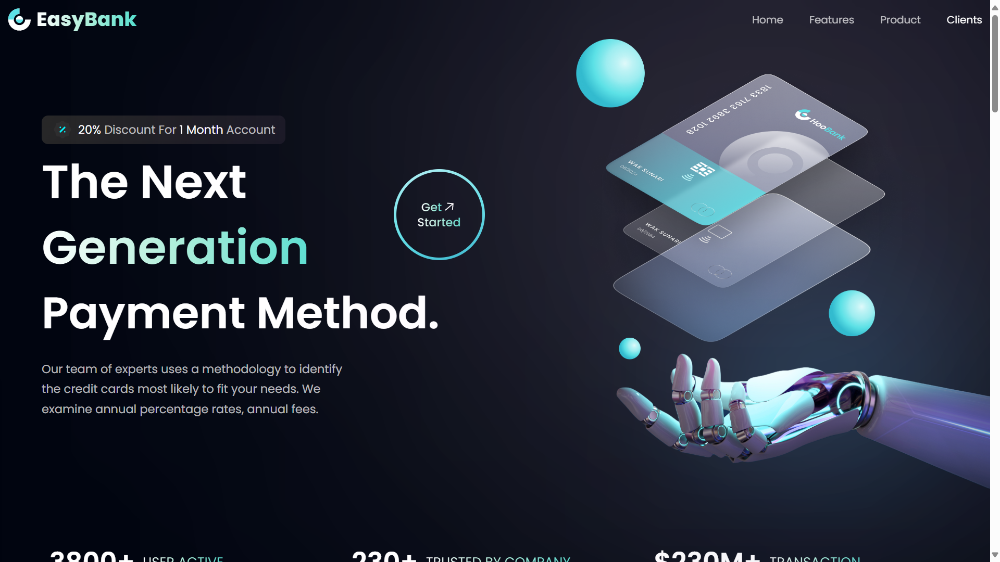
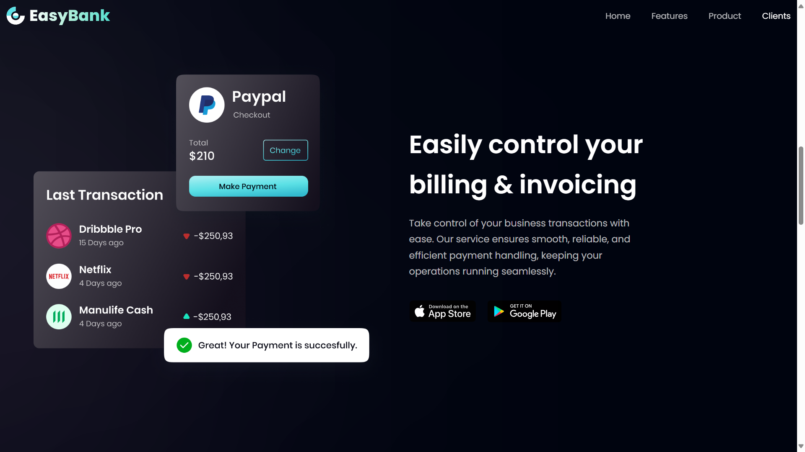
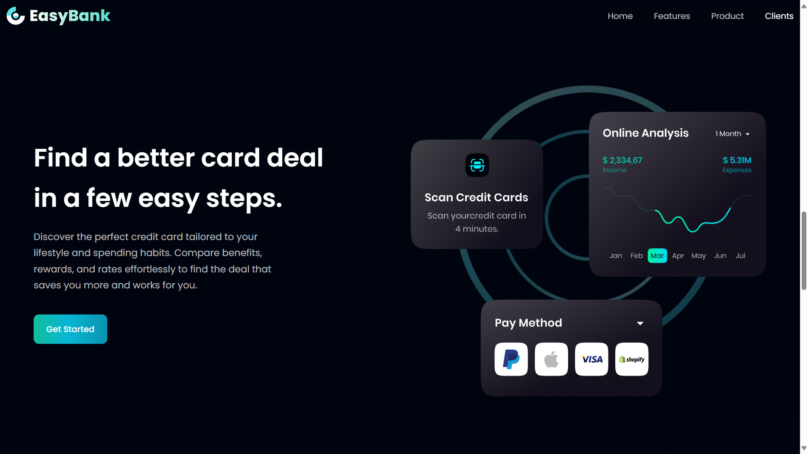

# EasyBank Landing Page

A modern, responsive landing page for EasyBank, built with **React JS**, **Tailwind CSS**, and **Framer Motion**. This project showcases clean animations, smooth scroll-triggered transitions, and a fully responsive design optimized for both desktop and mobile devices.

## Live Demo

[Check out the live site here](#) https://easy-bank-react-landing-page.vercel.app/

## Screenshots

## Hero Section:

## Product Section:

## Features

- Responsive, mobile-friendly design
- Scroll-triggered animations using Framer Motion
- Modern gradient buttons and animated text effects
- Fixed navbar with smooth hover effects
- Clean, component-based structure
- Easy to customize and extend

### Frontend Architecture
- **Framework**: React 18 with TypeScript
- **Styling**: TailwindCSS with custom CSS variables for theming
- **UI Components**: Radix UI primitives with shadcn/ui component library
- **Animations**: Framer Motion for smooth transitions and scroll-based animations
- **Routing**: Wouter for lightweight client-side routing
- **State Management**: React Query (@tanstack/react-query) for server state management
- **Build Tool**: Vite for fast development and optimized builds

### Frontend Dependencies
- **React Ecosystem**: React, React DOM, React Query
- **UI/UX**: Radix UI primitives, Framer Motion, Lucide React icons
- **Styling**: TailwindCSS, class-variance-authority, clsx
- **Forms**: React Hook Form with resolvers
- **Utilities**: date-fns, embla-carousel-react

## Changelog

Changelog:
- June 26, 2025. Initial setup

## User Preferences

Preferred communication style: Simple, everyday language.
